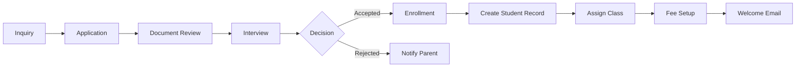
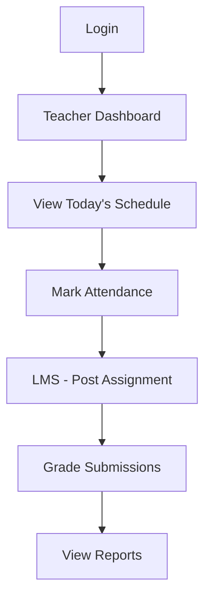
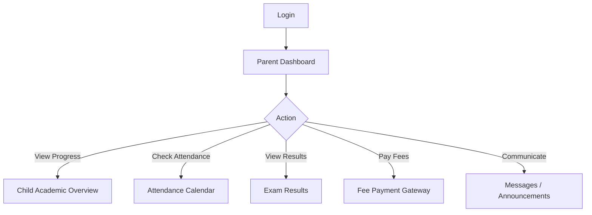
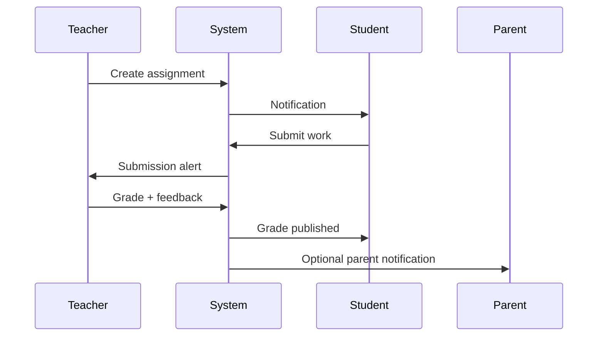
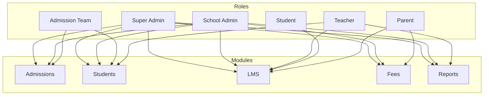

# EduNexus — School ERP + LMS Frontend Architecture

Enterprise-grade React + TypeScript frontend for a multi-role School ERP and Learning Management System.

---

## 1. Folder Structure

```
school-management/
├── public/
├── src/
│   ├── app/                          # Application shell
│   │   ├── App.tsx                   # Root component (useRoutes)
│   │   ├── providers/
│   │   │   └── AppProviders.tsx      # QueryClient + Router
│   │   └── router/
│   │       ├── routes.tsx            # Central route definitions
│   │       ├── ProtectedRoute.tsx    # Auth guard
│   │       └── RoleGuard.tsx         # Role-based access guard
│   │
│   ├── components/
│   │   ├── ui/                       # ShadCN-style primitives (design system atoms)
│   │   │   ├── button.tsx
│   │   │   ├── card.tsx
│   │   │   ├── badge.tsx
│   │   │   ├── avatar.tsx
│   │   │   ├── input.tsx
│   │   │   └── skeleton.tsx
│   │   ├── layout/                   # Shell components
│   │   │   ├── AuthLayout.tsx
│   │   │   ├── DashboardLayout.tsx
│   │   │   ├── Sidebar.tsx
│   │   │   ├── SidebarNav.tsx
│   │   │   └── Topbar.tsx
│   │   ├── common/                   # Shared business components
│   │   │   ├── StatCard.tsx
│   │   │   ├── PageHeader.tsx
│   │   │   ├── EmptyState.tsx
│   │   │   └── RoleBadge.tsx
│   │   └── charts/
│   │       └── DashboardChart.tsx
│   │
│   ├── config/
│   │   ├── navigation.ts             # Sidebar config per role
│   │   └── permissions.ts            # Module access matrix
│   │
│   ├── features/                     # Feature modules (domain-driven)
│   │   ├── admissions/
│   │   ├── students/
│   │   ├── teachers/
│   │   ├── parents/
│   │   ├── lms/
│   │   ├── academics/
│   │   ├── attendance/
│   │   ├── examinations/
│   │   ├── fees/
│   │   ├── reports/
│   │   └── shared/
│   │       └── ModulePage.tsx        # Scaffold placeholder
│   │
│   ├── hooks/
│   │   ├── useAuth.ts
│   │   └── useMediaQuery.ts
│   │
│   ├── lib/
│   │   ├── utils.ts                  # cn() helper
│   │   └── api/
│   │       ├── client.ts             # Axios instance
│   │       └── query-keys.ts         # React Query key factory
│   │
│   ├── pages/
│   │   ├── auth/
│   │   │   └── LoginPage.tsx
│   │   └── dashboards/               # Role-specific dashboards
│   │       ├── DashboardRouter.tsx
│   │       ├── SuperAdminDashboard.tsx
│   │       ├── SchoolAdminDashboard.tsx
│   │       ├── AdmissionDashboard.tsx
│   │       ├── TeacherDashboard.tsx
│   │       ├── StudentDashboard.tsx
│   │       └── ParentDashboard.tsx
│   │
│   ├── stores/                       # Zustand global state
│   │   ├── auth.store.ts
│   │   └── ui.store.ts
│   │
│   ├── types/
│   │   ├── auth.ts
│   │   ├── navigation.ts
│   │   └── common.ts
│   │
│   ├── index.css                     # Design tokens + Tailwind
│   └── main.tsx
│
├── ARCHITECTURE.md
├── index.html
├── package.json
├── tsconfig.json
└── vite.config.ts
```

### Feature Module Convention (per module)

```
features/admissions/
├── components/       # Module-specific UI
├── hooks/            # useAdmissions, useApplicationForm
├── api/              # admissions.api.ts
├── types/            # AdmissionApplication, Inquiry
└── pages/            # AdmissionsListPage, ApplicationDetailPage
```

---

## 2. Route Structure

| Path | Module | Roles |
|------|--------|-------|
| `/login` | Auth | Public |
| `/dashboard` | Dashboard | All authenticated |
| `/schools` | Multi-tenant | Super Admin |
| `/admissions` | Admissions | Super Admin, School Admin, Admission Team |
| `/admissions/inquiries` | Admissions | ↑ |
| `/admissions/applications` | Admissions | ↑ |
| `/admissions/enrollment` | Admissions | ↑ |
| `/students` | Student Management | Super Admin, School Admin, Admission Team, Teacher |
| `/students/classes` | Student Management | Super Admin, School Admin |
| `/teachers` | Teacher Management | Super Admin, School Admin |
| `/parents` | Parent Portal | Super Admin, School Admin, Parent |
| `/lms/courses` | LMS | All except Admission Team |
| `/lms/assignments` | LMS | ↑ |
| `/lms/resources` | LMS | ↑ |
| `/academics/timetable` | Academics | All except Admission Team |
| `/academics/syllabus` | Academics | Super Admin, School Admin, Teacher, Student |
| `/attendance` | Attendance | All except Admission Team |
| `/examinations/schedule` | Examinations | All except Admission Team |
| `/examinations/results` | Examinations | ↑ |
| `/fees/structure` | Fees | Super Admin, School Admin |
| `/fees/payments` | Fees | Super Admin, School Admin, Parent |
| `/reports` | Reports | Super Admin, School Admin, Teacher |
| `/settings` | Settings | Super Admin, School Admin |

### Route Guard Layers

```
Request → ProtectedRoute (auth) → RoleGuard (optional) → Page
```

---

## 3. Layout Design

### Auth Layout
- **Split screen**: Brand panel (left, desktop) + form (right)
- Mobile: Full-width form with compact logo
- Used for: Login, Forgot Password, Onboarding

### Dashboard Layout
```
┌─────────────────────────────────────────────────────────┐
│  Sidebar (64px collapsed / 256px expanded)  │  Topbar   │
│                                              ├──────────┤
│  - Logo + School name                        │          │
│  - Role-filtered navigation                  │  Main    │
│  - Collapsible groups                        │  Content │
│  - User card (bottom)                        │  Area    │
│                                              │          │
└──────────────────────────────────────────────┴──────────┘
```

### Responsive Behavior
| Breakpoint | Sidebar | Topbar |
|------------|---------|--------|
| `< lg` | Hidden, slide-over drawer | Hamburger menu |
| `≥ lg` | Fixed left, collapsible | Full search + profile |

---

## 4. Component Hierarchy

```
App
└── AppProviders (QueryClient, Router)
    └── useRoutes
        ├── AuthLayout
        │   └── LoginPage
        └── ProtectedRoute
            └── DashboardLayout
                ├── Sidebar
                │   └── SidebarNav → NavItem[]
                ├── Topbar
                └── Outlet (page content)
                    ├── DashboardRouter
                    │   └── [Role]Dashboard
                    │       ├── PageHeader
                    │       ├── StatCard[]
                    │       ├── DashboardChart
                    │       └── Card (activity, lists)
                    └── ModulePage / Feature Pages
                        ├── PageHeader
                        ├── Filters / Actions
                        ├── DataTable / Forms
                        └── EmptyState
```

### Component Layers

| Layer | Purpose | Examples |
|-------|---------|----------|
| **UI (Atoms)** | Stateless primitives | Button, Input, Card, Badge |
| **Common (Molecules)** | Reusable patterns | StatCard, PageHeader, EmptyState |
| **Layout (Organisms)** | Shell structure | Sidebar, Topbar, DashboardLayout |
| **Features (Templates)** | Domain pages | AdmissionsList, CourseDetail |
| **Pages** | Route entry points | DashboardRouter, LoginPage |

---

## 5. State Management Architecture

```
┌─────────────────────────────────────────────────────────┐
│                    STATE LAYERS                          │
├─────────────────┬───────────────────┬───────────────────┤
│  Zustand        │  React Query      │  React State      │
│  (Global UI)    │  (Server State)   │  (Local UI)       │
├─────────────────┼───────────────────┼───────────────────┤
│  auth.store     │  students query   │  form inputs      │
│  ui.store       │  admissions query │  modal open/close │
│  theme          │  dashboard stats  │  tab selection    │
│  sidebar state  │  cache + stale    │  accordion expand │
└─────────────────┴───────────────────┴───────────────────┘
```

### Zustand Stores

| Store | Persisted | Responsibility |
|-------|-----------|----------------|
| `auth.store` | Yes | User session, login/logout, demo role switching |
| `ui.store` | Yes | Sidebar collapse, mobile drawer, theme preference |

### React Query

- **Query keys**: Centralized in `lib/api/query-keys.ts`
- **Stale time**: 60s default
- **Pattern**: `useQuery({ queryKey, queryFn })` per feature hook

### Data Flow

```
Component → useFeatureHook() → React Query → apiClient → Backend API
                ↓
         Zustand (auth token in interceptor)
```

---

## 6. UI Design System

### Brand Palette

| Token | Value | Usage |
|-------|-------|-------|
| `brand-500` | `#6366f1` | Primary actions, active nav |
| `brand-600` | `#4f46e5` | Buttons, links |
| `accent-500` | `#10b981` | Success, positive trends |
| `background` | `#f8fafc` | Page background |
| `card` | `#ffffff` | Cards, sidebar |
| `muted-foreground` | `#64748b` | Secondary text |
| `border` | `#e2e8f0` | Dividers, inputs |

### Typography

- **Font**: Inter (400, 500, 600, 700)
- **Page title**: `text-2xl sm:text-3xl font-bold`
- **Section title**: `text-lg font-semibold`
- **Body**: `text-sm`
- **Caption**: `text-xs text-muted-foreground`

### Spacing & Radius

- **Card radius**: `rounded-xl` (12px)
- **Button radius**: `rounded-lg` (8px)
- **Page padding**: `p-4 lg:p-6`
- **Grid gap**: `gap-4` (stats), `gap-6` (sections)

### Shadows

- **Card**: `--shadow-card` (subtle)
- **Elevated**: `--shadow-elevated` (modals, login card)

### Component Variants (CVA)

- **Button**: default, secondary, outline, ghost, destructive, link
- **Badge**: default, secondary, success, warning, destructive

---

## 7. Dashboard Designs

### Super Admin
- **Focus**: Multi-tenant platform health
- **Metrics**: Schools, Students, Teachers, Revenue
- **Widgets**: Enrollment growth chart, Top schools list

### School Admin
- **Focus**: Single-school operations
- **Metrics**: Students, Pending admissions, Attendance, Fee collection
- **Widgets**: Attendance chart, Recent activity feed
- **Actions**: Export report, New admission

### Admission Team
- **Focus**: Pipeline conversion
- **Metrics**: Inquiries, Applications, Interviews, Enrolled
- **Widgets**: Admission funnel (4-stage pipeline)

### Teacher
- **Focus**: Daily teaching workflow
- **Metrics**: Classes, Students, Pending grading, Attendance marked
- **Widgets**: Today's schedule timeline

### Student
- **Focus**: Learning progress
- **Metrics**: Attendance, Assignments due, Courses, GPA
- **Widgets**: Upcoming deadlines, Today's classes

### Parent
- **Focus**: Child monitoring
- **Metrics**: Children count, Avg attendance, Fee due, Messages
- **Widgets**: Child cards with attendance/GPA badges
- **Actions**: Pay fees

---

## 8. Sidebar Structure

### Super Admin
```
Dashboard
Schools
Admissions ▸
  Inquiries | Applications | Enrollment
Students ▸
  Directory | Classes & Sections
Teachers
Parent Portal
LMS ▸
  Courses | Assignments | Resources
Academics ▸
  Timetable | Syllabus
Attendance
Examinations ▸
  Exam Schedule | Results
Fees ▸
  Fee Structure | Payments
Reports
Settings
```

### School Admin
Same as Super Admin minus **Schools**

### Admission Team
```
Dashboard
Admissions ▸ (full)
Students ▸ (Directory only)
```

### Teacher
```
Dashboard
Students (Directory)
LMS ▸
Academics ▸ (Timetable, Syllabus)
Attendance
Examinations ▸
Reports
```

### Student
```
Dashboard
LMS ▸
Academics ▸ (Timetable, Syllabus)
Attendance
Examinations ▸
```

### Parent
```
Dashboard
Parent Portal
LMS ▸ (view child's courses)
Academics ▸ (Timetable)
Attendance
Examinations ▸ (Results)
Fees ▸ (Payments)
```

Navigation is driven by `config/navigation.ts` — filtered at runtime by `getNavigationForRole(role)`.

---

## 9. User Flow Diagrams

### Authentication Flow

```mermaid
flowchart TD
    A[Visit /] --> B{Authenticated?}
    B -->|No| C[/login]
    B -->|Yes| D[Role-based redirect]
    C --> E[Enter credentials]
    E --> F[API validates]
    F -->|Success| G[Store user in auth.store]
    G --> D
    F -->|Failure| H[Show error]
    H --> C
    D --> I{Role}
    I -->|super_admin| J[/dashboard - Platform]
    I -->|school_admin| K[/dashboard - School]
    I -->|admission_team| L[/admissions]
    I -->|teacher| M[/dashboard - Teacher]
    I -->|student| N[/dashboard - Student]
    I -->|parent| O[/dashboard - Parent]
```

### Admission Workflow



### Teacher Daily Flow



### Parent Portal Flow



### LMS Assignment Flow



### Module Access Matrix



---

## Getting Started

```bash
npm install
npm run dev
```

Open `http://localhost:5173` and use **Quick demo** buttons on the login page to switch between all 6 roles.

## Next Steps

1. Connect `lib/api/client.ts` to your backend
2. Replace `ModulePage` scaffolds with feature-specific pages
3. Add ShadCN components via `npx shadcn@latest init` for DataTable, Dialog, Select
4. Implement form validation with `react-hook-form` + `zod`
5. Add E2E tests with Playwright per critical user flow
